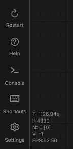
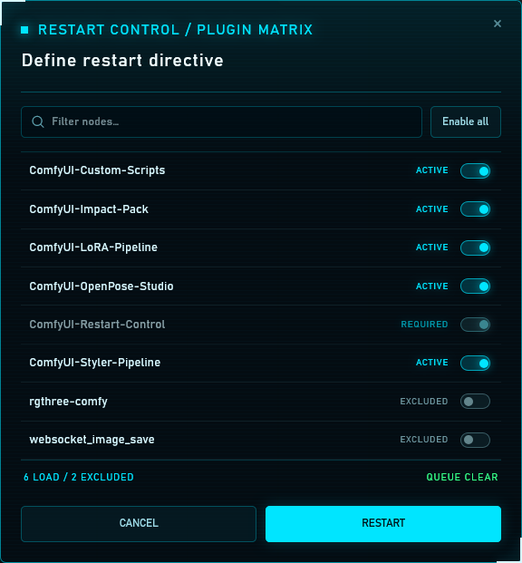
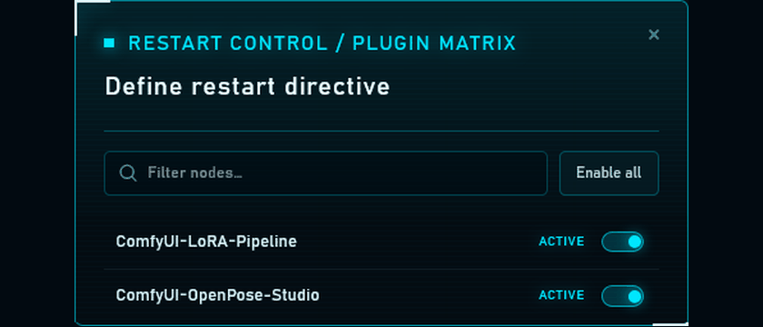

<p align="center">
  
  
  
</p>
<br />

# ComfyUI Restart Control

ComfyUI Restart Control adds a native-looking **Restart** action immediately above **Help** in the left sidebar. Every click opens a plugin matrix where you choose which custom nodes load on the next boot. It then replaces the backend process, waits for a new boot ID, and reloads the interface automatically.

## Preview

### Sidebar action

Restart Control places the restart action directly above Help.

<p align="center">
  
</p>

### Plugin matrix

Choose the custom nodes that will load on the next restart.

<p align="center">
  
</p>

### Boot trace

Restart Control locks the workspace and reports the backend handoff until the new instance is available.

<p align="center">
  
</p>

## Installation

### Local or manual installation

Clone the repository into `ComfyUI/custom_nodes`:

```bash
cd ComfyUI/custom_nodes
git clone https://github.com/andreszs/ComfyUI-Restart-Control.git
```

Restart ComfyUI once so the backend route and frontend extension are loaded.

### Comfy Registry / Manager

After the initial Registry release, search for **ComfyUI Restart Control** in ComfyUI Manager or install it with the Comfy CLI:

```bash
comfy node install restart-control
```

## Usage

1. Select **Restart** in the left sidebar.
2. Choose the custom nodes for the next boot and review the queue status.
3. Select **RESTART**.
4. Keep the page open while the Boot Trace display shows the elapsed boot ID wait.
5. The page reloads after the backend reports a different boot ID.

Double clicks and concurrent restart requests are blocked. Restart Control never cancels or clears the queue itself.

While the restart overlay is active, the underlying workspace is inert and workflow-editing shortcuts are blocked so changes cannot be made to an instance that is shutting down. Browser recovery shortcuts such as refresh and address-bar navigation remain available.

### Next-boot plugin profile

- Select **Restart** to open the plugin matrix, then turn off one or more custom nodes for the next boot. Search and a contextual **Enable all**/**Disable all** control are available for larger installations.
- Only custom nodes from the original active profile are listed. Restart Control is always enabled so the restart control remains available.
- A plugin excluded by the previous selective restart returns enabled as **STAGED**, indicating that it will load on the next restart unless excluded again.
- The matrix starts from the original plugin profile every time. Excluding plugins uses `--disable-all-custom-nodes` with an exact `--whitelist-custom-nodes` selection for that boot; restarting without exclusions restores the original launch arguments.

## Tasks in progress

The plugin matrix states the number of running and pending tasks. A restart can interrupt running work. Pending tasks remain in ComfyUI's in-memory queue only for as long as the process exists, so do not assume they survive a full backend replacement.

## Security model

Each backend boot creates a random restart token. The frontend reads it from the capabilities endpoint and sends it in a custom header. The restart endpoint accepts only same-origin JSON POST requests, compares the token safely, validates selective profiles against the current custom-node inventory, and locks after the first accepted request. Arbitrary command-line arguments cannot be submitted through the endpoint.

This protects against accidental requests and ordinary cross-site request forgery. It is not a separate authentication system: anyone who legitimately controls a ComfyUI browser session can obtain the token and request a restart.

## Compatibility

The extension requires ComfyUI Frontend 1.6.13 or newer. Currently verified only against the local Windows Portable installation using ComfyUI Frontend 1.45.21. Manual Python/venv, Linux, macOS, ComfyUI Desktop, reverse proxies, and remote browsers remain unverified until they are tested directly.

When replacing the backend process, Restart Control preserves ComfyUI's original command-line arguments and adds ComfyUI's official `--disable-auto-launch` flag if it is absent. This prevents Windows Portable from opening a second browser tab while the existing tab waits and reloads itself. Selective profiles additionally manage `--disable-all-custom-nodes` and `--whitelist-custom-nodes`; a restart with the complete profile restores the saved arguments.

The frontend currently offers a public sidebar tab API but no public API for a button-only action in the lower sidebar group. Restart Control registers through `app.extensionManager.registerSidebarTab`, then an isolated compatibility layer relocates that native button before the stable Help control and intercepts its click. The installer is idempotent and observes sidebar rerenders without duplicating buttons or observers.

## Remote instances

The browser request must remain same-origin with the ComfyUI host. A correctly configured same-origin reverse proxy should work, but that setup has not yet been verified. Cross-origin embedding or a separate frontend origin is intentionally rejected.

## Troubleshooting

- **Restart is missing:** restart ComfyUI once after installing and hard-refresh the browser.
- **Restart request rejected:** verify that the page and API use the same host and port.
- **ComfyUI does not reconnect:** use **Try again** or **Reload now** in the status overlay, then inspect the ComfyUI console for `comfyui.restart_control` errors.
- **ComfyUI is still using a selective profile:** open **Restart**, leave every available plugin enabled, and select **RESTART** to restore the original launch arguments.
- **A task was interrupted:** the dialog warns before restart; the extension does not cancel or drain active work.

## Development and tests

From this directory, run:

```powershell
C:\ComfyUI_windows_portable\python_embeded\python.exe -m unittest discover -s tests -p "test_*.py"
npm test
npm run lint
```

Python linting uses Ruff when available:

```powershell
ruff check .
```

Automated tests replace `os.execv` with a test double and never restart the real process. The frontend test covers queue messages, boot ID completion, and polling backoff. Exact placement, collapsed/expanded rendering, themes, the native dialog, and real reconnection are validated in a running ComfyUI browser.

## License

MIT. See [LICENSE](LICENSE).

## More ComfyUI tools by andreszs

- [LoRA Pipeline](https://github.com/andreszs/comfyui-lora-pipeline) — Area-based LoRA scheduling and conditioning wrappers.
- [OpenPose Studio](https://github.com/andreszs/comfyui-openpose-studio) — Visual multi-person pose editing with ControlNet-ready outputs.
- [Styler Pipeline](https://github.com/andreszs/comfyui-styler-pipeline) — AI-assisted style suggestions and conditioning tools.
- [Ultralytics Studio](https://github.com/andreszs/ComfyUI-Ultralytics-Studio) — Ultralytics tooling for ComfyUI workflows.

Discover more projects from [@andreszs on GitHub](https://github.com/andreszs).
